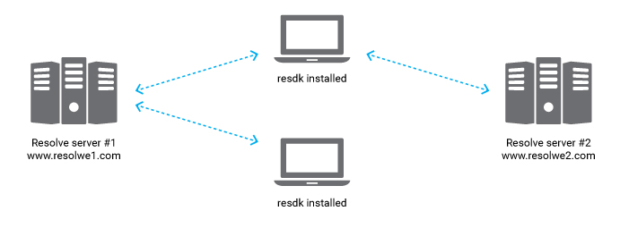
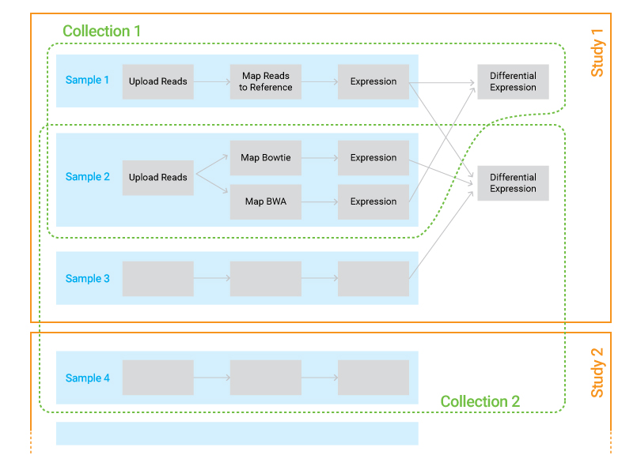

.. _introduction:

============
Introduction
============

We will explain some basic concepts about Resolwe. Remember them well
as they will be used through documentation.

About Resolwe, Resolwe Bio and SDK for Python
=============================================

`Resolwe`_ is an open source dataflow package for the
`Django framework`_. `Resolwe Bioinformatics`_ is an extension of
Resolwe that provides bioinformatics pipelines. Together, they can
handle large quantities of biological data, perform complex data
analysis, organize results and automatically document your work in
a reproducible fashion.

Resolwe SDK for Python allows you to access Resolwe and Resolwe Bio from
Python. It supports accessing, modifying, uploading and downloading the
data, and writing dataflow pipelines.

.. _Resolwe Bioinformatics: https://github.com/genialis/resolwe-bio
.. _Resolwe: https://github.com/genialis/resolwe
.. _Django framework: https://www.djangoproject.com/

Resolwe and Resolwe Bio run on servers with strong computational
capabilities. ``resdk`` is a Python package on a local computer
that interacts with Resolwe through a RESTful API. The power of
``resdk`` is its lightweight character. It is installed with one
simple command, but supports the manipulation of large data sets
and heavy computation on a remote computer cluster.

Connect to Resolwe
------------------

We have a test Resolwe server on ``https://torta.bcm.genialis.com``.
If you do not have access to Torta, contact us at info@genialis.com.
The user name and password are ``admin/admin``.

.. literalinclude:: files/example_index.py
   :lines: 1-7

If you are working with ``resdk`` in an interactive session, the
logging feature prints useful messages. They will let you know
what is happening behind the scenes. Read more about
:ref:`how the logging is configured in resdk<resdk_resdk_logger>`
or about `Python logging`_ in general.

.. _`Python logging`: https://docs.python.org/2/howto/logging.html

Resolwe basics---resources
==========================

In Resolwe, meta-data is stored in the PostgreSQL database tables:
Data, Sample, Collection, Process, DescriptorSchema, Storage,
User and Group. We support the data management through the `REST API`_.
Each table is represented as a REST resource with a corresponding
endpoint. The Sample table is a special case, represented by two
resources: ``sample`` and ``presample``. More details on samples will
be given later.

In ``resdk`` each REST API endpoint has a corresponding class, with
the same name as in Resolwe: :class:`Process<resdk.resources.Process>`,
:class:`Data<resdk.resources.Data>`,
:class:`Sample<resdk.resources.Sample>` and
:class:`Collection<resdk.resources.Collection>`. Most resources
are implemented in resdk as subclasses of
:class:`BaseResource<resdk.resources.base.BaseResource>`.

.. _REST API: https://torta.bcm.genialis.com/api/

Process and Data
----------------

Two most important resources in Resolwe are *process* and *data*.
Process stores an algorithm that transforms inputs into outputs. It
is a *blueprint* for one step in the analysis. A Data object is an
instance of a process. It is a *complete record* of the process step.

**Example use case:** you have a file with NGS read sequences
(``reads.fastq``) and want to map them to the human genome
(``hg38.fasta``) with the *Bowtie* aligner. All you have to do is
create a Data object---set the process and inputs. When a Data object
is created, the platform automatically runs the given process with
provided inputs. A Data object is a complete record of the processing.
It remembers the inputs (files, arguments, parameters...), the process
(the algorithm) and the outputs (files, images, numbers...). In
addition, Data objects store some useful meta data. This makes it
easy to reproduce the dataflow as well as simply access information.

.. note::

   In the documentation we will refer to process in two different
   contexts. The first has just been presented: the blueprint for
   data objects. In this respect, data object is an instance of a
   process. However, when talking about specific data object, we
   may wish to refer to the algorithm that turned inputs to
   outputs---on this specific data object. We sometimes call
   this as a process as well.

Groups of Data objects
----------------------

Eventually, you will have many Data objects and want to
organize them. Resolwe includes different structures to help you group
Data objects: *Sample* and *Collection*.

**Sample** represents a biological entity. It includes user annotations
(GEO compliant) and Data objects associated with this biological entity.
In practice, all Data objects on the sample are derived from an initial
single Data object. A Data object can belong to only one sample.
Typically a sample would contain the following data: raw reads,
aligned reads, and expressions. Two distinct samples can not
contain the same Data object

**Collection** is a working (user-defined, *ad hoc*) group of samples.
In addition to samples and their data, collections may contain
Data objects that store analysis results (*e.g.,* differential
expressions). Samples and Data objects may be in multiple collections.

   Relations between samples and collections. Samples
   are groups of Data objects originating from the same biological
   sample—all Data objects in a sample are derived from a single NGS
   reads file. Collections are arbitrary groups of samples
   and Data objects that store analysis results.

.. TODO: Image where clear distinction between Resolwe models /
         endpoints and resdk classes is presented.

Annotations
===========

Annotations are presented as descriptors, where each descriptor is defined in
descriptor schemas. Annotations for data objects, samples and collections are
following different descriptor schemas. For example reads data object can be
annotated with 'reads' descriptor schema, while sample can be annotated by
'sample' annotation schema. Each data object that is part of sample is
also connected to sample annotation, so that the annotation for sample (also
collection) represents all Data objects attached to it. Examples of descriptors
and descriptor schemas are described in details in `Resolwe Bioinformatics
documentation`_.

.. _Resolwe Bioinformatics documentation: http://resolwe-bio.readthedocs.io

Here we show how to annotate the reads data object by defining a descriptor
information (annotation) that follows annotation fields as defined in the
'reads' descriptor schema:

.. code-block:: python

    annotation_reads = {
        'experiment_type': 'RNA-seq',
        'protocols': {
            'growth_protocol': 'my growth protocol',
            'treatment_protocol': 'my treatment protocol',
            'library_prep': 'lybrary construction protocol',
        },
        'reads_info': {
            'seq_date': '2016-10-13',
            'instrument_type': 'Illumina',
            'facility': 'my favorite facility',
        }
    }

We can now annotate ``reads`` data object by adding descriptor and descriptor schema:

.. code-block:: python

    #define the chosen descriptor schema,
    reads.descriptor_schema = 'reads'

    #define the reads descriptor, with
    reads.descriptor = annotation_reads

    #save the annotation
    reads.save()

We can also define descriptor and descriptor schema directly when calling
'res.run' function as described in The run method section.

Managing presamples and samples
===============================

When a new data object that represents a biological sample (i.e. fastq files,
bam files) is uploaded to the database, the unannotated sample (presample) is
automatically created. When a data object that belongs to an existing (pre)sample
is used as an input to trigger new analysis, the output of the new analysis is
automatically attached to an existing (pre)sample.

Unannotated samples (presamples) have a presample property set to ``True``. To
annotate a presample, fill its descriptor and set ``presample`` property to
``False``. Following is an example of annotation of presample, that was
automatically created when reads were uploaded.

.. code-block:: python

    annotation_sample = {
        'sample': {
            'annotator': 'my name',
            'organism': 'Homo sapiens',
            'source': 'isolated DNA',
            'cell_type': 'houman podocytes',
            'genotype': 'abcg2-',
            'molecule': 'total RNA',
            'optional_char': ['my_characteristic:{}'.format('value')],
            'description': 'any additional description',
            },
        'other': 'any other information',
    }

    # define presample name
    reads.presample.name = 'My favorite sample'

    #add descriptor schema to sample
    reads.presample.descriptor_schema = 'sample'

    # define presample description
    reads.presample.descriptor = annotation_sample

    # transform presample to sample
    reads.presample.presample = False

    #save presample as sample with the same name
    reads.presample.save()

.. note::
    When presample is marked as annotated, we can access it as ``sample`` property:

    .. code-block:: python

        reads.sample

Additionally, we can also confirm that the sample is annotated, change sample
name or slug:

.. code-block:: python

    #change sample name and slug
    reads.sample.name = 'My sample 2'
    reads.sample.slug = 'my-sample-2'
    reads.sample.save()

Managing collections
====================

To keep a clear structure of data objects and samples we can create collections.
Here is an example of how to create new collection and add (and remove) data to
(from) a collection:

.. code-block:: python

    # import collection from resdk.resources
    from resdk.resources import Collection

    # create collection
    test_collection = Collection(resolwe=res)

    # name the collection
    test_collection.name = 'Test collection'

    #define the collection slug
    test_collection.slug = 'test-collection'

    #save new collection
    test_collection.save()

    #add data to collection
    test_collection.add_data(reads)

    #remove data to collection
    test_collection.remove_data(reads)

Data object can be added to collections also when running a process, as described
in following chapter The Run method.

Query resources
===============

To get a list of data objects, presamples or samples stored in collection or to
search for specific type or name of data object we can use a powerful and easy
to use query system.

The :class:`resdk.Resolwe` class includes queries for the following object types:

* ``process``
* ``data``
* ``sample``
* ``collection``

Each object type has a corresponding class in Resolwe. Interfaces support
``get()`` and ``filter()`` methods that enable users to access the resources:

.. code-block:: python

    resdk.Resolwe.<object_type>.filter(**fields)
    resdk.Resolwe.<object_type>.get(uid)

The :any:`filter(**fields)<ResolweQuery.filter>` method returns a list of
objects of of object type:

.. literalinclude:: files/example_intro.py
   :lines: 9-13

But the real power of the ``filter()`` method is in combining multiple filter
parameters:

.. literalinclude:: files/example_intro.py
   :lines: 15-16

In a single line we have obtained all data objects that:

* were successfully created (no errors)
* were using the process with name "Aligner (Bowtie 1.0.0)"

Additionally we ordered results by creation time and limited the number of
returned results to three.

The :any:`get()<ResolweQuery.get>` method searches by the same parameters as
``filter`` and returns a single object of type ``<interface>``. But if only one
parameter is given, it will be interpreted as s unique identifier ``id`` or
``slug``, depending on if it is number or string.

.. literalinclude:: files/example_intro.py
   :lines: 3-7

For mostly used filtering options we created following shortcuts, which give us
a list of `data`, `samples` or `collections`:

* ``<collection>.data``
* ``<collection>.samples``
* ``<sample>.data``
* ``<sample>.collections``
* ``<data>.collections``
* ``<data>.sample``
* ``<data>.presample``

Following are some examples of filtering of collections, samples and data
objects:

.. code-block:: python

    # select collection with name 'Test collection'
    test_collection = res.collection.get(name='Test collection')

    # list of samples in 'Test collection'
    sample_list = test_collection.samples

    # list of data in my collection
    test_collection.data

    # list of data in samples that starts with 'case' that is part of 'Test collection'
    sample_list.filter(name__startswith='case')

    # get list of two data objects with following names: 'reads-1', 'reads-2':
    res.data.filter(name__in=['reads-1', 'reads-2'])

    # get list of data that were modified in year 2015 or later
    res.data.filter(modified__year__gte=2015)

    # select 'case_1' from 'my collection'
    case_1 = sample_list.get(name='case_1')

    # select 'case_1' bam file
    bam = case_1.data.get(type='data:alignment:bam:')

    # in which collections is sample 'case_1'
    list_collections = case_1.collections

    # in which collections is data 'bam'
    list_collections = bam.collections

More powerful query options are described in `SDK Reference`_

.. _SDK Reference: http://resdk.readthedocs.io/en/latest/ref.html

Access meta-data and download files
------------------------------------

We have learned how to query the resources with ``get``, ``filter`` or by using
shortcuts. Now we will look at how to access the information in these resources.
All the resources share some common attributes like ``name``, ``id``, ``slug``,
``created`` and ``permissions``. You can access them like any other Python class
attributes.

.. literalinclude:: files/example_intro.py
   :lines: 18-31

Besides these attributes, each resource class has some specific attributes and
methods. For example, resource classes ``Data``, ``Sample`` and ``Collection``
have methods ``files()`` and ``download()``.

The ``files()`` method returns a list of all files on the resource:

 .. literalinclude:: files/example_intro.py
    :lines: 33-43

Method ``download()`` downloads the resource files. Optional parameters
``file_name`` and ``field_name`` have the same effect as in the ``files``
method. There is additional parameter ``download_dir`` - that allows you to
specify the download directory:

.. literalinclude:: files/example_intro.py
   :lines: 45-49

You can find the complete reference for each resource class and their
corresponding attributes and methods in the :doc:`Reference<ref>`.

.. note::

   Some attributes and methods are defined in
   :obj:`BaseCollection<resdk.resources.collection.BaseCollection>`
   and :obj:`BaseResource<resdk.resources.base.BaseResource>`
   classes. :obj:`BaseResource<resdk.resources.base.BaseResource>`
   is the parent of all resource classes in :obj:`resdk`.
   :obj:`BaseCollection<resdk.resources.collection.BaseCollection>`
   is the parent of all collection-like classes:
   :obj:`Sample<resdk.resources.Sample>` and
   :obj:`Collection<resdk.resources.Collection>`

You have learned about the resources and how to access data. Continue with the
:ref:`run`.
