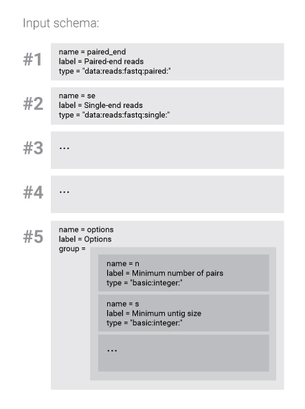

.. _run:

=============================
Upload data and run pipelines
=============================

So far we were been inspecting data: accessing information and
downloading files. Here we explain how to upload new data and run
data analytics pipelines.

The obvious way to start the analysis is to upload some data to Resolwe.
We do that with `upload processes`_. To upload the data
we run the same commands as for running other analysis processes.
We have inputs (path to some file on our local
computer), an algorithm (to pre-process the input files) and
output (a reference to the file that was just uploaded).

.. _`upload processes`: http://resolwe-bio.readthedocs.io/en/latest/catalog.html#upload

There are many upload processes, since there are many different types
of files we can upload. Where to get information about existing
processes? You can browse the `Process catalog`_ or use the SDK:

.. _`Process catalog`: http://resolwe-bio.readthedocs.io/en/latest/catalog.html

.. literalinclude:: files/example_run.py
   :lines: 3-4

The run method
==============

Uploading files to Resolwe is done with a single command. You can
download example NGS read files here: `forward read pair`_,
`reverse read pair`_.

.. _`forward read pair`: https://torta.bcm.genialis.com/data/553/reads_paired_abyss_1.fastq.gz?force_download=1
.. _`reverse read pair`: https://torta.bcm.genialis.com/data/553/reads_paired_abyss_2.fastq.gz?force_download=1

.. literalinclude:: files/example_run.py
   :lines: 6-11

As you can see, we have provided just process ``slug`` and ``input``
parameters. What the method returns is a data object (here we call it
``reads``). After the upload reads, we may want to assemble
those NGS sequences with *Abyss*:

.. literalinclude:: files/example_run.py
   :lines: 13-18

Here you see how to use a data object that is already uploaded on
Resolwe---by its id.

You probably noticed that we get the result almost instantly, while the
typical assembling process runs for hours. This is because
processing runs asynchronously, so the returned data object does not
have an OK status or outputs when returned. Use
``assembled_reads.update()`` to refresh the information. You can
access the progress report with ``assembled_reads.process_progress``.

The documentation of the :any:`run <Resolwe.run>` method tells us how
to run a process in general:

.. code-block:: python

    result = res.run(slug=None,
                     input={},
                     descriptor=None,
                     descriptor_schema=None,
                     collections=[],
                     data_name='',
                     src=None,
                     tools=None)

The parameters will be described in the following sections.

Slug
----

The first argument is the slug of process. Slug is a human readable
unique identifier. You can find the process slug with methods
``get()`` end ``filter()`` on the ``process`` endpoint.

Input
-----

As seen in the upper example, inputs are given with a dictionary of
``"input_name":input_value`` pairs. But how to know what are
the possible inputs for a given process? Well, this is exactly
what input schema is for---it defines the names and types of inputs
for a given process:

.. literalinclude:: files/example_run.py
   :lines: 20-21

The output may not be visually intuitive so this image will help
explain the structure:

   An ``input_schema`` is a *list* of *dictionaries*---in this case
   there are 5 of them. Each dictionary contains three mandatory fields:
   ``name``, ``label`` and ``type``, and some optional fields. This
   the case for all dictionaries in the ``input_schema``, except for
   those with the ``group`` key. The group key organizes a set of
   inputs, one level lower in hierarchy. Typically, these are flags
   and parameters for the command line programs used in the process'
   algorithm.

A handy function when inspecting process inputs is ``print_inputs()``:

.. literalinclude:: files/example_run.py
   :lines: 23-24

The output is a quick reference in the form of
``- name [type] - label``. Each input corresponds to one line and
``group`` inputs are indented to make a clear separation from the top
level inputs.

Descriptor schema and descriptor
--------------------------------

When creating a data object (*e.g.,* uploading reads), you can
provide a ``descriptor_schema`` and a ``descriptor``.
The descriptor_schema defines how the descriptor should look like. If
you provide these the descriptor and descriptor_schema, Resolwe will
create a *sample* with the annotation defined in descriptor. It will
also include the created data object (uploaded reads) in the sample.
Additionally, all data objects derived from reads, will be
automatically included in the same sample.

Collections
-----------

If you would like to include the data object in a certain collection,
this is the place to do it. Provide a list of collection IDs and the
data object will be included in all of them.

Data name
---------

If you would like to manually set the name of the created data
object, provide it with the ``data_name`` parameter.

Src and tools
-------------

These are used only when developing your own processes. More
about that is in the :ref:`pipelines` chapter.

-----------------------------------------------------------------------

Now that we know how the handle the parameters, lets create a
data object with ful set of parameters:

.. literalinclude:: files/example_run.py
   :lines: 26-53

What just happened?

* A data object was created what triggered the execution of the
  ``assembler-abyss`` process.
* Process will use single-end reads from data object ``reads``, the
  name of the assembler output files will be ``blah_blah`` and the
  assembler will use the flags ``k`` and ``n`` with values 20 and 30.
* We provided the descriptor schema and descriptor with some basic
  sample information.
* Data object will be included in collections 1 and 2.
* Data object name was set to "my_favourite_name".

Get or run
----------

Get or run method, checks if the the process have been already run with the
same inputs. If it was, it directly returns the outputs, otherwise it runs the
process. This method saves lots of time if we need to run some processes all
over again with minor changes in inputs parameters.

.. code-block:: python

   # if we run again assembler-abyss process with same inputs, we will get
   # directly the outputs created in previous run
   assembled_reads_1 = res.get_or_run(slug='assembler-abyss', input=inputs)

Solving problems
================

Sometimes the data object will not have an "OK" status. In such case,
it is helpful to be able to check what went wrong (and where).
The :any:`stdout <resdk.resources.Data.stdout>` method on data objects
can help---it returns the standard output of the data object
(as string).

.. literalinclude:: files/example_run.py
   :lines: 55-62

Also, you can inspect the info, warning and error logs.

.. literalinclude:: files/example_run.py
   :lines: 64-71

-----------------------------------------------------------------------

This should get you started. For more information about Resolwe visit
`Resolwe documentation.`_ Let's continue with :ref:`pipelines`.

.. _`Resolwe documentation.`: http://resolwe.readthedocs.io/en/latest/

