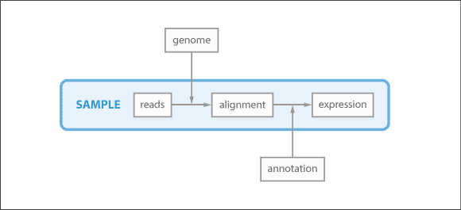
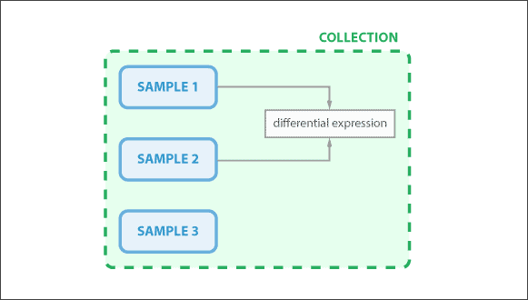
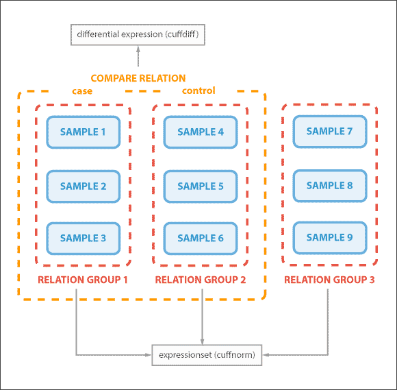
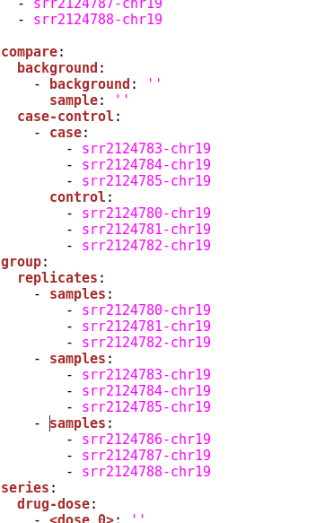

.. _tutorial-diffexp:

========================
Differential expressions
========================

In this tutorial we will learn how to run a differential expression
analysis. We will become familiar with the concepts of *sample*,
*collection* and *relation*. We will create a collection, add
samples to that collection and define relations between samples.
Then we will learn how to quantify bam files using *cuffquant* and
use the results to run *cuffnorm* expression and *cuffdiff*
differential expression.

Samples
=======

Thus far we have introduced the *process* and *data* concepts. Next up is the `sample`_
concept. Samples represent a unique biological entity, such as a single tissue extraction processed
for RNA-seq and run on an Illumina sequencer. A technical replicate of the same material would be a
new Sample, as would a DNA-seq library from the same tissue extract. A Sample encompasses a lineage
of data objects, and typically contains raw reads, aligned reads and expressions (or variants, peaks, etc).
When a data object that represents a biological sample is uploaded (e.g. a fastq or BAM file),
a sample is automatically created. Each data object can belong to only one sample.

.. _sample: http://resdk.readthedocs.io/en/latest/ref.html#resdk.resources.Sample

	Sample schema showing which data objects belong to a sample in which do not.

.. warning::
	You have to be connected to the Resolwe server to continue. We have done that in
        the `Getting started`_ section. If you have lost the connection (by exiting Python
	or closing the terminal) you have to connect again.

	.. _Getting started: http://resdk.readthedocs.io/en/latest/start.html#query-data

Now let's see which samples are already on the server (and we have permission to view):

.. code-block:: python

	res.sample.all()

and again use `filters`_ to find samples prepared for this tutorial:

.. _filters: http://resdk.readthedocs.io/en/latest/ref.html#resdk.ResolweQuery

.. code-block:: python

	res.sample.filter(name__endswith='chr19', created__date='2017-06-06')

We can `get`_ one of the queried samples and inspect it:

.. _get: http://resdk.readthedocs.io/en/latest/ref.html#resdk.ResolweQuery.get

.. code-block:: python

	# Get the sample
	sample = res.sample.get(187)

	# All data objects in the sample
	sample.data

.. Note::

	Samples, genome file (FASTA) and annotation file (GTF) used in this tutorial were obtained `here`_.
	Sample information can also be found with ReSDK (if the sample is annotated):

	.. code-block:: python

		sample.descriptor

	.. _here: https://www.ncbi.nlm.nih.gov/geo/query/acc.cgi?acc=GSE71234

	All files (i.e. all data objects) were later cropped to mouse chromosome 19, the shortest in that genome.
	Cropping was done so that the processes used in this tutorial finish quickly.

Collections
===========

In most cases, a bunch of biological samples are part of the same experiment. It would be great if we had
a way to bunch and operate on samples together. Actually, we have two ways to do this. This first is by
creating an entity called a `collection`_. A collection is an ad hoc working group of samples. Typical
collections contain samples and their data, and often also contain other data objects like analysis results
(e.g., differential expressions), other sampleless data (e.g., genomes) or data whose sample is not yet
part of the collection. One important note: if a collection contains a sample, it automatically contains
the associated sample data. However, if a collection contains a sample's associated data, it does not
necessarily contain the sample itself.

.. _collection: http://resdk.readthedocs.io/en/latest/ref.html#resdk.resources.Collection

	Collection schema showing that a data object can be in a collection even though
	it does not belong to any sample. Collection samples data objects are also inside
	the collection.

Now that we know what a collection is, let us create one:

.. code-block:: python

	collection = res.collection.create(name='Tutorial: <First and Last Name>')

where instead of <First and Last Name> you insert your name. We ask you to follow this naming
convention so that we have an easier job managing data on the server. We will now add queried
samples to our new collection:

.. code-block:: python

	samples = res.sample.filter(name__endswith='chr19', created__date='2017-06-06')

	collection.add_samples(*samples)

All our samples are now added to the collection. We can see the list of samples in a collection,
and also if a selected sample is in any collection and in which ones:

.. code-block:: python

	# List of samples in a collection
	collection.samples

	# Collections in which a sample is
	sample.collections

.. warning::

	The tutorial collection you have just created is for ReSDK training only and will be
	removed from the server in a month.

In the first tutorial (Getting Started) we ran HISAT2 aligment process on one of our samples.
Now we want to run HISAT2 process on all of our samples at once. Since they are now all in the
same collection, this can be easily accomplished by running HISAT2 on the whole collection:

.. code-block:: python

	# Get genome data object for the alignment
	genome = res.data.get('genome-mm10-chr19')

	# Run hisat2 on a collection
	collection.run_hisat2(genome)

.. note::

	Hisat2 can be run on different entities: data object, sample, collection, relation.

Relations
=========

We mentioned that there are two ways of connecting samples. We are now familiar with the
first one, collection. The second one is via `relation`_. A relation is just what the name
implies — the affiliation between samples. For example, Sample 1 and Sample 2 may be related
in that they are replicates. The relation concept is a bit different to that of a collection.
For starters, a relation can only contain samples and cannot contain additional data. It is
essentially a finer grouping of samples. We define three types of relations — 'compare',
'group' and 'series'. In this tutorial we will cover 'compare' (usually used for case-control or
sample-background) and 'group' relations (usually used for replicates). 'Series' relations are
usually used for time- or dosage- series.

.. _relation: http://resdk.readthedocs.io/en/latest/ref.html#resdk.resources.Relation

	Relation schema showing a compare relation and three group relations. Compare relation
	is used for the differential expression and group relations are used for the expressionset.

The simplest way to create relations is to download a relations template from a collection,
define relations and finally apply it to the server by importing it. We will now download the
template (YAML file):

.. code-block:: python

	collection.export_relations()

The file has been downloaded to your working directory. When you open it in text editor you will
see that creating sample relations is nicely explained. However we will go through creating 'group'
replicates relations and 'compare' case-control relations. In this case, the grouping of the samples is
arbitrary and has no biological basis. It is just a showcase of how to create relations.
You may decide to group samples differently and still continue with the tutorial.

Scrolling down in the YAML file will bring you to the list of samples in the collection. These are
the samples available for constructing relations. We will now show how to create a 'group' replicates
relations and a 'compare' case-control relation:

We have defined relations between samples. Save the file and apply the changes by importing:

.. code-block:: python

	collection.import_relations()

We can now check what we have created:

.. code-block:: python

	# Get the latest meta data from the server
	collection.update()

	# All relations in our collection
	collection.relations

We are now ready to run some expression and differential expression analyses.

Cuffquant, Cuffnorm and Cuffdiff
================================

Before we get to *cuffnorm* and *cuffdiff* analysis we will run *cuffquant*. This will save
us some time later on because *cuffnorm* and *cuffdiff* will recieve quantified inputs insted of
BAM files. For any of these analysis we will also need an appropriate annotation file (GTF, GFF).
We can query and get it:

.. code-block:: python

	res.data.filter(type='data:annotation:gtf', created__date='2017-06-06')

	annotation = res.data.get('annotation-mm10-chr19')

Let us now run *cuffquant* on all the samples in our *collection*:

.. code-block:: python

	collection.run_cuffquant(annotation)

.. note::

	Cuffquant can be run on different entities: sample, collection, relation.
	It can also be run on a list of entities.

We can now continue with *cuffnorm*. It can also be run on a collection and it will automatically
recognize all the 'group' relations we have imported earlier:

.. code-block:: python

	collection.run_cuffnorm(annotation)

We can now inpect *cuffnorm* results:

.. code-block:: python

	# Get the latest meta data from the server
	collection.update()

	# Query cuffnorm data object
	collection.data.filter(type='data:expressionset:cuffnorm')

	# Get cuffnorm data object
	cuffnorm = collection.data.get(<id or slug of the selected data object>)

	# Files available for download
	cuffnorm.files()

We can download any of these files. We will now download the boxplot file to our working directory:

.. code-block:: python

	cuffnorm.download('cuffnorm_exprs_boxplot.pdf')

.. note::

	Cuffnorm can be run on a relation or a collection.
	It can also be run on a list samples, relations or collections.

We will now run *cuffdiff* on our collection. It will automatically recognize all 'compare'
relations we imported earlier:

.. code-block:: python

	collection.run_cuffdiff(annotation)

Although we are working with small data objects, *cuffdiff* may take a couple of minutes to
finish processing. We can check the `status`_ of the process:

.. _status: http://resdk.readthedocs.io/en/latest/ref.html#resdk.resources.Data.status

.. code-block:: python

	# Get the latest meta data from the server
	collection.update()

	# Query cuffdiff data object
	collection.data.filter(type='data:differentialexpression:cuffdiff')

	# Get cuffdiff data object
	cuffdiff = collection.data.get(<id or slug of the selected data object>)

	# Check the status of the process
	cuffdiff.update()
	cuffdiff.status

Inspecting results is done in a similar manner as before with *cuffnorm*:

.. code-block:: python

	# Files available for download
	cuffdiff.files()

	# Download all files to our working directory
	cuffdiff.download()

.. note::

	Cuffdiff can be run on a relation or a collection.
	It can also be run on a list samples, relations or collections.

We have now run several processes on each of our samples and created some new data objects in
each sample. If we remember our first data query on our sample, we only got one data object
and that was reads data object. We have since created many new data objects on our sample:

.. code-block:: python

	sample.data

We have come to the end of Differential expressions tutorial. You are now acquainted with some
powerful concepts (sample, collection and relation) and know how to run differential expressions
(and other processes) on samples that are already on the server. In the next tutorial we will
learn how to work with your own data.
